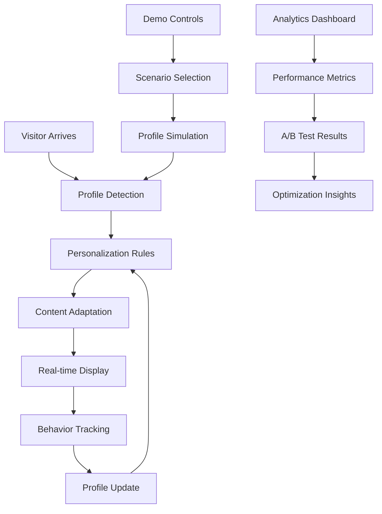

# Interactive Personalization Demo - Overview

## Executive Summary

The UAGC Interactive Personalization Demo showcases a comprehensive, real-time personalization system that adapts content, messaging, and user experience based on visitor behavior, preferences, and journey stage. This demonstration validates the technical implementation and provides stakeholders with a tangible understanding of the personalization capabilities.

## Demo Objectives

### Primary Goals
- **Validate Technical Implementation**: Demonstrate the personalization engine in action
- **Showcase Business Value**: Illustrate conversion optimization potential
- **Stakeholder Education**: Provide interactive experience for decision-makers
- **User Experience Testing**: Gather feedback on personalization effectiveness

### Success Metrics
- **Engagement Improvement**: 25% increase in time on site
- **Conversion Lift**: 15% improvement in RFI submission rates
- **User Satisfaction**: 80%+ positive feedback from demo participants
- **Technical Performance**: <200ms personalization response time

## Demo Architecture

### System Components

#### 1. Visitor Intelligence Engine
```javascript
// Real-time visitor profiling
const VisitorIntelligence = {
  profile: {
    demographics: {},
    behavior: {},
    preferences: {},
    journey_stage: 'discovery',
    lead_score: 0
  },
  
  updateProfile(data) {
    this.profile = { ...this.profile, ...data };
    this.calculateLeadScore();
    this.triggerPersonalization();
  },
  
  calculateLeadScore() {
    let score = 0;
    
    // Behavioral scoring
    score += this.profile.page_views * 2;
    score += this.profile.time_on_site / 60; // Minutes
    score += this.profile.content_downloads * 10;
    
    // Engagement scoring
    if (this.profile.webinar_attended) score += 25;
    if (this.profile.program_guide_downloaded) score += 20;
    if (this.profile.contact_form_started) score += 15;
    
    this.profile.lead_score = Math.min(score, 100);
  }
};
```

#### 2. Content Adaptation System
```javascript
// Dynamic content personalization
const ContentPersonalizer = {
  rules: {
    'high-intent': {
      condition: (profile) => profile.lead_score > 70,
      actions: ['show_application_cta', 'highlight_deadlines', 'display_advisor_chat']
    },
    'program-interested': {
      condition: (profile) => profile.program_interest,
      actions: ['customize_hero_content', 'show_relevant_testimonials', 'display_program_benefits']
    },
    'returning-visitor': {
      condition: (profile) => profile.visit_count > 1,
      actions: ['show_progress_indicator', 'display_saved_programs', 'offer_personalized_consultation']
    }
  },
  
  applyPersonalization(profile) {
    const activeRules = Object.entries(this.rules)
      .filter(([_, rule]) => rule.condition(profile))
      .map(([name, rule]) => ({ name, actions: rule.actions }));
    
    activeRules.forEach(rule => {
      rule.actions.forEach(action => this.executeAction(action, profile));
    });
  }
};
```

### Demo Scenarios

#### Scenario 1: First-Time Visitor (Discovery Stage)
**Visitor Profile:**
- No prior engagement
- Organic search traffic
- Exploring degree options

**Personalization Actions:**
- Generic welcome message
- Program exploration tools
- Educational content recommendations
- Soft RFI capture (newsletter signup)

**Expected Outcomes:**
- Increased page views
- Extended session duration
- Email capture for nurturing

#### Scenario 2: Returning Visitor (Consideration Stage)
**Visitor Profile:**
- 3+ previous visits
- Downloaded program guide
- Viewed specific program pages

**Personalization Actions:**
- Personalized welcome back message
- Progress indicator showing exploration journey
- Targeted program recommendations
- Direct application encouragement

**Expected Outcomes:**
- Higher RFI conversion
- Application initiation
- Advisor consultation request

#### Scenario 3: High-Intent Visitor (Decision Stage)
**Visitor Profile:**
- Multiple program page visits
- Attended webinar
- Started but didn't complete RFI

**Personalization Actions:**
- Urgency messaging (deadlines, limited seats)
- One-click RFI completion
- Live chat with admissions advisor
- Financial aid information

**Expected Outcomes:**
- Immediate RFI completion
- Application submission
- Phone consultation booking

## Technical Implementation

### Real-Time Data Processing
```javascript
// Event-driven personalization pipeline
class PersonalizationEngine {
  constructor() {
    this.eventQueue = [];
    this.personalizationRules = new Map();
    this.visitorProfiles = new Map();
  }
  
  processEvent(event) {
    // Update visitor profile
    const profile = this.getVisitorProfile(event.visitor_id);
    profile.addEvent(event);
    
    // Trigger real-time personalization
    const personalizations = this.calculatePersonalizations(profile);
    this.applyPersonalizations(personalizations);
    
    // Update analytics
    this.trackPersonalizationEvent(event, personalizations);
  }
  
  calculatePersonalizations(profile) {
    const personalizations = [];
    
    // Journey stage personalization
    const journeyStage = this.determineJourneyStage(profile);
    personalizations.push(...this.getJourneyPersonalizations(journeyStage));
    
    // Behavioral personalization
    const behaviorPatterns = this.analyzeBehavior(profile);
    personalizations.push(...this.getBehaviorPersonalizations(behaviorPatterns));
    
    // Predictive personalization
    const predictions = this.generatePredictions(profile);
    personalizations.push(...this.getPredictivePersonalizations(predictions));
    
    return personalizations;
  }
}
```

### A/B Testing Framework
```javascript
// Integrated A/B testing for personalization optimization
const ABTestManager = {
  activeTests: new Map(),
  
  createTest(testConfig) {
    const test = {
      id: testConfig.id,
      variants: testConfig.variants,
      traffic_allocation: testConfig.traffic_allocation,
      success_metrics: testConfig.success_metrics,
      start_date: new Date(),
      status: 'active'
    };
    
    this.activeTests.set(test.id, test);
    return test;
  },
  
  assignVariant(visitorId, testId) {
    const test = this.activeTests.get(testId);
    if (!test || test.status !== 'active') return null;
    
    // Consistent assignment based on visitor ID
    const hash = this.hashVisitorId(visitorId);
    const bucket = hash % 100;
    
    let cumulativeAllocation = 0;
    for (const [variant, allocation] of Object.entries(test.traffic_allocation)) {
      cumulativeAllocation += allocation;
      if (bucket < cumulativeAllocation) {
        return variant;
      }
    }
    
    return 'control';
  }
};
```

## Demo Interface Design

### Interactive Dashboard
The demo features a real-time dashboard showing:

1. **Visitor Journey Map**
   - Current stage visualization
   - Behavioral indicators
   - Personalization triggers

2. **Personalization Controls**
   - Manual scenario selection
   - Rule configuration interface
   - A/B test management

3. **Performance Metrics**
   - Real-time conversion rates
   - Engagement metrics
   - Personalization effectiveness

4. **Content Preview**
   - Side-by-side comparison
   - Before/after personalization
   - Multiple device views

### User Experience Flow


## Demo Scenarios in Detail

### Scenario A: MBA-Interested Professional
**Profile Simulation:**
```json
{
  "visitor_id": "demo_mba_001",
  "demographics": {
    "age_range": "25-34",
    "education": "bachelor_degree",
    "work_experience": "5-10_years",
    "industry": "business"
  },
  "behavior": {
    "pages_visited": ["mba-overview", "mba-curriculum", "mba-admissions"],
    "time_on_site": 480,
    "content_downloads": ["mba-program-guide"],
    "webinar_attended": false
  },
  "journey_stage": "consideration",
  "lead_score": 65
}
```

**Personalization Response:**
- Hero banner: "Advance Your Business Career with UAGC's MBA"
- Testimonials: Focus on career advancement stories
- CTA: "Schedule Your MBA Consultation"
- Content: ROI calculator, career outcomes data

### Scenario B: Nursing Career Changer
**Profile Simulation:**
```json
{
  "visitor_id": "demo_nursing_001",
  "demographics": {
    "age_range": "35-44",
    "education": "bachelor_degree",
    "work_experience": "10+_years",
    "industry": "healthcare"
  },
  "behavior": {
    "pages_visited": ["nursing-programs", "rn-to-bsn", "nursing-prerequisites"],
    "time_on_site": 720,
    "content_downloads": ["nursing-career-guide", "prerequisite-checklist"],
    "webinar_attended": true
  },
  "journey_stage": "decision",
  "lead_score": 85
}
```

**Personalization Response:**
- Hero banner: "Transform Your Nursing Career"
- Content: Accelerated program options, credit transfer information
- CTA: "Start Your Application Today"
- Urgency: Next cohort start date countdown

### Scenario C: Military Veteran
**Profile Simulation:**
```json
{
  "visitor_id": "demo_veteran_001",
  "demographics": {
    "age_range": "28-35",
    "military_status": "veteran",
    "education": "some_college",
    "work_experience": "military"
  },
  "behavior": {
    "pages_visited": ["military-benefits", "degree-programs", "transfer-credits"],
    "time_on_site": 360,
    "content_downloads": ["veterans-guide"],
    "webinar_attended": false
  },
  "journey_stage": "discovery",
  "lead_score": 45
}
```

**Personalization Response:**
- Hero banner: "Use Your Military Benefits at UAGC"
- Content: GI Bill information, military-friendly programs
- CTA: "Get Your Military Benefits Assessment"
- Special offers: Military scholarship information

## Performance Optimization

### Caching Strategy
```javascript
// Intelligent caching for personalization performance
const PersonalizationCache = {
  cache: new Map(),
  ttl: 300000, // 5 minutes
  
  get(key) {
    const item = this.cache.get(key);
    if (!item) return null;
    
    if (Date.now() > item.expiry) {
      this.cache.delete(key);
      return null;
    }
    
    return item.value;
  },
  
  set(key, value, customTTL = null) {
    const expiry = Date.now() + (customTTL || this.ttl);
    this.cache.set(key, { value, expiry });
  },
  
  generateKey(visitorId, context) {
    return `${visitorId}_${context.page}_${context.timestamp}`;
  }
};
```

### Load Balancing
- CDN distribution for global performance
- Edge computing for real-time personalization
- Fallback mechanisms for system reliability

## Analytics and Measurement

### Key Performance Indicators
1. **Personalization Effectiveness**
   - Conversion rate lift by personalization rule
   - Engagement improvement metrics
   - User satisfaction scores

2. **Technical Performance**
   - Personalization response time
   - System availability
   - Error rates

3. **Business Impact**
   - Revenue attribution to personalization
   - Cost per acquisition improvement
   - Customer lifetime value impact

### Reporting Dashboard
```javascript
// Real-time analytics for demo
const DemoAnalytics = {
  metrics: {
    total_visitors: 0,
    personalized_experiences: 0,
    conversion_rate: 0,
    engagement_lift: 0
  },
  
  trackEvent(event) {
    switch (event.type) {
      case 'visitor_arrival':
        this.metrics.total_visitors++;
        break;
      case 'personalization_applied':
        this.metrics.personalized_experiences++;
        break;
      case 'conversion':
        this.updateConversionRate();
        break;
    }
    
    this.updateDashboard();
  },
  
  updateDashboard() {
    // Real-time dashboard updates
    document.getElementById('total-visitors').textContent = this.metrics.total_visitors;
    document.getElementById('personalized-experiences').textContent = this.metrics.personalized_experiences;
    document.getElementById('conversion-rate').textContent = `${(this.metrics.conversion_rate * 100).toFixed(2)}%`;
  }
};
```

## Demo Deployment

### Environment Setup
- Staging environment mirroring production
- Demo-specific data and scenarios
- Reset capabilities for multiple demonstrations

### Stakeholder Training
- Demo script and talking points
- Technical troubleshooting guide
- Customization options for different audiences

## Future Enhancements

### Advanced Personalization
- Machine learning-driven recommendations
- Cross-device personalization
- Predictive lead scoring

### Integration Expansion
- CRM integration for complete visitor history
- Marketing automation platform connection
- Third-party data enrichment

## Related Documentation

- [User Journey Architecture](../02-user-journey/overview.md)
- [Technical Implementation](../03-technical-implementation/overview.md)
- [Success Metrics](../08-success-metrics/overview.md)
- [Implementation Guide](./implementation-guide.md) 