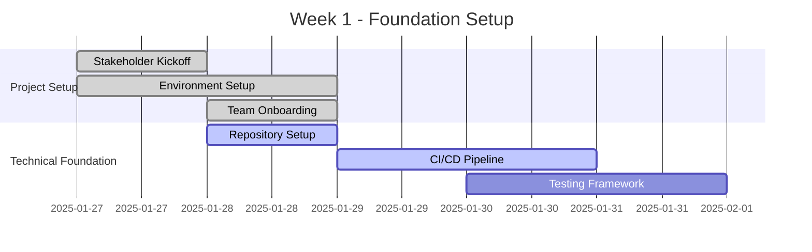

# Implementation Timeline - Overview

## Executive Summary

The UAGC Implementation Timeline provides a comprehensive roadmap for deploying the complete personalization and tracking system. This strategic timeline balances technical complexity, stakeholder needs, and business priorities to ensure successful delivery within a 6-week implementation window.

## Project Scope and Objectives

### Primary Deliverables
- **UTM Framework & Attribution System**: Complete tracking infrastructure
- **User Journey Architecture**: Behavioral tracking and personalization engine
- **Technical Implementation**: Core systems and integrations
- **Submission Tracking**: RFI and application conversion optimization
- **Cookie Compliance**: GDPR/CCPA compliant consent management
- **Interactive Demo**: Stakeholder validation and training platform
- **Success Metrics**: Analytics and reporting infrastructure

### Success Criteria
- **Technical Performance**: <200ms personalization response time
- **Conversion Improvement**: 15% increase in RFI submissions
- **Compliance Achievement**: 100% GDPR/CCPA compliance
- **Stakeholder Adoption**: 90% team training completion
- **System Reliability**: 99.9% uptime during peak periods

## 6-Week Implementation Schedule

### Week 1: Foundation and Planning (Jan 27 - Feb 2, 2025)

#### Phase 1.1: Project Initiation (Days 1-2)
**Objectives:**
- Finalize project scope and requirements
- Establish team structure and communication protocols
- Set up development and staging environments

**Key Activities:**


**Deliverables:**
- [ ] Project charter and scope document
- [ ] Development environment configured
- [ ] Git repository with branching strategy
- [ ] CI/CD pipeline operational
- [ ] Team access and permissions established

#### Phase 1.2: UTM Framework Implementation (Days 3-5)
**Objectives:**
- Deploy comprehensive UTM tracking system
- Establish attribution modeling foundation
- Integrate with existing analytics platforms

**Technical Implementation:**
```javascript
// Week 1 UTM Implementation Milestones
const week1Milestones = {
  day3: {
    tasks: ['UTM parameter capture', 'Cookie storage implementation'],
    deliverables: ['UTM tracking script', 'Storage utilities']
  },
  day4: {
    tasks: ['GA4 integration', 'Attribution modeling'],
    deliverables: ['Analytics configuration', 'Attribution logic']
  },
  day5: {
    tasks: ['Testing and validation', 'Documentation'],
    deliverables: ['Test suite', 'Implementation docs']
  }
};
```

### Week 2: Core Systems Development (Feb 3 - Feb 9, 2025)

#### Phase 2.1: User Journey Architecture (Days 6-8)
**Objectives:**
- Implement behavioral tracking system
- Deploy personalization engine foundation
- Establish visitor profiling capabilities

**Key Components:**
- Real-time event tracking
- Visitor profile management
- Journey stage detection
- Behavioral scoring algorithms

#### Phase 2.2: Technical Infrastructure (Days 9-10)
**Objectives:**
- Deploy core technical components
- Establish API integrations
- Implement security frameworks

**Architecture Deployment:**
```yaml
# Week 2 Infrastructure Deployment
services:
  personalization-engine:
    image: uagc/personalization:v1.0
    ports: ["8080:8080"]
    environment:
      - NODE_ENV=staging
      - REDIS_URL=redis://redis:6379
  
  analytics-service:
    image: uagc/analytics:v1.0
    ports: ["8081:8081"]
    depends_on: ["redis", "postgres"]
  
  api-gateway:
    image: uagc/gateway:v1.0
    ports: ["80:80"]
    environment:
      - RATE_LIMIT=1000
```

### Week 3: Integration and Personalization (Feb 10 - Feb 16, 2025)

#### Phase 3.1: Submission Tracking System (Days 11-13)
**Objectives:**
- Implement comprehensive form tracking
- Deploy Salesforce CRM integration
- Establish conversion optimization

**Integration Points:**
- RFI form enhancement
- Application tracking
- Lead scoring automation
- CRM data synchronization

#### Phase 3.2: Cookie Compliance Framework (Days 14-15)
**Objectives:**
- Deploy GDPR/CCPA compliant cookie system
- Implement OneTrust integration
- Establish consent management

**Compliance Implementation:**
```javascript
// Week 3 Compliance Milestones
const complianceFramework = {
  cookieCategories: {
    essential: { required: true, description: 'Site functionality' },
    analytics: { required: false, description: 'Usage analytics' },
    personalization: { required: false, description: 'Content customization' },
    marketing: { required: false, description: 'Targeted advertising' }
  },
  
  consentManagement: {
    banner: 'OneTrust integration',
    preferences: 'Granular controls',
    crossDomain: 'Unified consent across UAGC domains'
  }
};
```

### Week 4: Advanced Features and Testing (Feb 17 - Feb 23, 2025)

#### Phase 4.1: Personalization Demo Development (Days 16-18)
**Objectives:**
- Build interactive demonstration platform
- Create stakeholder training materials
- Develop scenario-based showcases

**Demo Components:**
- Real-time personalization showcase
- A/B testing simulation
- Performance metrics dashboard
- Stakeholder control interface

#### Phase 4.2: Success Metrics Implementation (Days 19-20)
**Objectives:**
- Deploy comprehensive analytics framework
- Establish automated reporting
- Create executive dashboards

**Metrics Infrastructure:**
```python
# Week 4 Analytics Implementation
class MetricsFramework:
    def __init__(self):
        self.kpis = {
            'conversion_rate': 'RFI submissions / Total visitors',
            'lead_quality': 'Average lead score',
            'personalization_lift': 'Personalized vs. generic performance',
            'cost_per_acquisition': 'Total ad spend / Conversions'
        }
        
    def generate_executive_report(self):
        return {
            'summary': self.calculate_summary_metrics(),
            'trends': self.analyze_trends(),
            'recommendations': self.generate_recommendations()
        }
```

### Week 5: System Integration and Optimization (Feb 24 - Mar 2, 2025)

#### Phase 5.1: Cross-Domain Synchronization (Days 21-23)
**Objectives:**
- Implement multi-domain tracking
- Deploy visitor profile synchronization
- Establish secure cross-domain communication

**Cross-Domain Architecture:**
```javascript
// Week 5 Cross-Domain Implementation
const crossDomainSync = {
  domains: [
    'uagc.edu',
    'cloud.mail.uagc.edu',
    'portal.uagc.edu',
    'apply.uagc.edu'
  ],
  
  syncMethods: {
    postMessage: 'Real-time profile sync',
    iframe: 'Secure token exchange',
    api: 'Batch profile updates'
  },
  
  security: {
    encryption: 'AES-256',
    authentication: 'JWT tokens',
    validation: 'Domain whitelist'
  }
};
```

#### Phase 5.2: Performance Optimization (Days 24-25)
**Objectives:**
- Optimize system performance
- Implement caching strategies
- Conduct load testing

**Performance Targets:**
- Personalization response: <200ms
- Page load impact: <50ms
- API response time: <100ms
- Cache hit rate: >90%

### Week 6: Launch Preparation and Go-Live (Mar 3 - Mar 9, 2025)

#### Phase 6.1: User Acceptance Testing (Days 26-28)
**Objectives:**
- Conduct comprehensive system testing
- Validate stakeholder requirements
- Perform security audits

**Testing Framework:**
```javascript
// Week 6 Testing Protocol
const testingSuite = {
  functional: {
    personalization: 'Scenario-based testing',
    tracking: 'Event validation',
    compliance: 'Privacy audit',
    performance: 'Load testing'
  },
  
  userAcceptance: {
    stakeholders: ['Marketing', 'Admissions', 'IT', 'Compliance'],
    scenarios: ['New visitor', 'Returning user', 'High-intent lead'],
    criteria: ['Functionality', 'Performance', 'Usability']
  }
};
```

#### Phase 6.2: Production Deployment (Days 29-30)
**Objectives:**
- Execute production deployment
- Monitor system performance
- Conduct post-launch validation

**Go-Live Checklist:**
- [ ] Production environment validated
- [ ] DNS and CDN configured
- [ ] Monitoring and alerting active
- [ ] Backup and recovery tested
- [ ] Team training completed
- [ ] Documentation finalized

## Resource Allocation and Team Structure

### Core Team Members

#### Technical Team
```yaml
roles:
  tech_lead:
    name: "Senior Full-Stack Developer"
    responsibilities: ["Architecture", "Code review", "Technical decisions"]
    allocation: "100% for 6 weeks"
  
  frontend_dev:
    name: "Frontend Developer"
    responsibilities: ["UI/UX", "Personalization interface", "Demo development"]
    allocation: "100% for 6 weeks"
  
  backend_dev:
    name: "Backend Developer"
    responsibilities: ["API development", "Database design", "Integrations"]
    allocation: "100% for 6 weeks"
  
  devops_engineer:
    name: "DevOps Engineer"
    responsibilities: ["Infrastructure", "CI/CD", "Monitoring"]
    allocation: "50% for 6 weeks"
```

#### Business Team
```yaml
business_roles:
  project_manager:
    responsibilities: ["Timeline management", "Stakeholder communication"]
    allocation: "100% for 6 weeks"
  
  marketing_lead:
    responsibilities: ["Requirements validation", "Content strategy"]
    allocation: "25% for 6 weeks"
  
  compliance_officer:
    responsibilities: ["Privacy requirements", "Legal review"]
    allocation: "25% for 6 weeks"
```

### Budget Allocation

#### Development Costs
```javascript
const budgetBreakdown = {
  personnel: {
    development_team: 240000, // 4 developers x 6 weeks
    project_management: 36000,
    business_stakeholders: 24000
  },
  
  infrastructure: {
    cloud_services: 12000,
    third_party_tools: 8000,
    monitoring_tools: 4000
  },
  
  external_services: {
    onetrust_license: 15000,
    analytics_tools: 6000,
    testing_tools: 3000
  },
  
  contingency: 34800, // 10% of total
  
  total: 382800
};
```

## Risk Management and Mitigation

### High-Risk Areas

#### Technical Risks
```yaml
technical_risks:
  integration_complexity:
    probability: "Medium"
    impact: "High"
    mitigation: "Phased integration approach, early prototyping"
  
  performance_issues:
    probability: "Medium"
    impact: "Medium"
    mitigation: "Load testing, performance monitoring, caching strategy"
  
  cross_domain_challenges:
    probability: "High"
    impact: "Medium"
    mitigation: "Browser testing, fallback mechanisms"
```

#### Business Risks
```yaml
business_risks:
  stakeholder_alignment:
    probability: "Medium"
    impact: "High"
    mitigation: "Regular demos, clear communication, requirement validation"
  
  compliance_requirements:
    probability: "Low"
    impact: "High"
    mitigation: "Legal review, privacy audit, compliance testing"
  
  timeline_pressure:
    probability: "Medium"
    impact: "Medium"
    mitigation: "Agile methodology, scope flexibility, resource buffer"
```

### Contingency Plans

#### Technical Contingencies
1. **Integration Failures**: Fallback to manual processes with automated migration
2. **Performance Issues**: Simplified personalization with gradual enhancement
3. **Browser Compatibility**: Progressive enhancement with graceful degradation

#### Business Contingencies
1. **Scope Changes**: Agile sprint adjustment with stakeholder approval
2. **Resource Constraints**: Priority-based feature delivery
3. **Timeline Delays**: Phased rollout with core features first

## Quality Assurance and Testing

### Testing Strategy

#### Automated Testing
```javascript
// Testing Framework Structure
const testingFramework = {
  unit_tests: {
    coverage: ">90%",
    frameworks: ["Jest", "Mocha"],
    scope: "Individual functions and components"
  },
  
  integration_tests: {
    coverage: ">80%",
    frameworks: ["Cypress", "Playwright"],
    scope: "API endpoints and service interactions"
  },
  
  e2e_tests: {
    coverage: "Critical user journeys",
    frameworks: ["Selenium", "Puppeteer"],
    scope: "Complete user workflows"
  }
};
```

#### Manual Testing
- Cross-browser compatibility testing
- Accessibility compliance validation
- User experience testing
- Performance benchmarking

### Quality Gates

#### Weekly Quality Checkpoints
```yaml
quality_gates:
  week_1:
    criteria: ["Environment setup", "Basic UTM tracking", "Initial tests"]
    approval: "Technical Lead"
  
  week_2:
    criteria: ["Core systems functional", "API integrations", "Performance baseline"]
    approval: "Technical Lead + Project Manager"
  
  week_3:
    criteria: ["Personalization working", "Compliance implemented", "Integration tests"]
    approval: "Full team review"
  
  week_4:
    criteria: ["Demo functional", "Analytics working", "User acceptance criteria"]
    approval: "Stakeholder review"
  
  week_5:
    criteria: ["Performance optimized", "Cross-domain sync", "Security audit"]
    approval: "Technical and security review"
  
  week_6:
    criteria: ["Production ready", "Documentation complete", "Training delivered"]
    approval: "Go-live approval"
```

## Communication and Reporting

### Stakeholder Communication Plan

#### Daily Standups
- **Participants**: Core development team
- **Duration**: 15 minutes
- **Format**: Progress, blockers, next steps

#### Weekly Status Reports
- **Recipients**: Stakeholders and management
- **Content**: Progress summary, risk assessment, next week preview
- **Format**: Executive dashboard with detailed appendix

#### Milestone Demonstrations
- **Frequency**: End of each week
- **Participants**: Extended stakeholder group
- **Purpose**: Validate progress and gather feedback

### Reporting Dashboard

```javascript
// Project Status Dashboard
const projectDashboard = {
  progress: {
    overall: "67%", // Calculated from completed milestones
    technical: "70%",
    business: "65%",
    testing: "60%"
  },
  
  timeline: {
    current_week: 4,
    total_weeks: 6,
    on_schedule: true,
    at_risk_items: ["Cross-domain testing", "Performance optimization"]
  },
  
  quality: {
    test_coverage: "85%",
    bug_count: 12,
    critical_issues: 1,
    performance_score: "Good"
  },
  
  risks: {
    high: 1,
    medium: 3,
    low: 5,
    mitigated: 8
  }
};
```

## Post-Launch Support and Maintenance

### Immediate Post-Launch (Week 7-8)

#### Monitoring and Support
- 24/7 system monitoring
- Rapid response to critical issues
- Performance optimization based on real usage
- User feedback collection and analysis

#### Success Validation
- Conversion rate measurement
- Performance benchmarking
- User satisfaction surveys
- Stakeholder feedback sessions

### Long-term Maintenance (Month 2+)

#### Continuous Improvement
- Monthly performance reviews
- Quarterly feature enhancements
- Annual system updates
- Ongoing compliance monitoring

#### Team Transition
- Knowledge transfer to operations team
- Documentation handover
- Training for support staff
- Escalation procedures establishment

## Related Documentation

- [Project Task Manager](../../PROJECT-TASK-MANAGER.md)
- [Technical Implementation](../03-technical-implementation/overview.md)
- [Success Metrics](../08-success-metrics/overview.md)
- [Implementation Guide](./implementation-guide.md) 